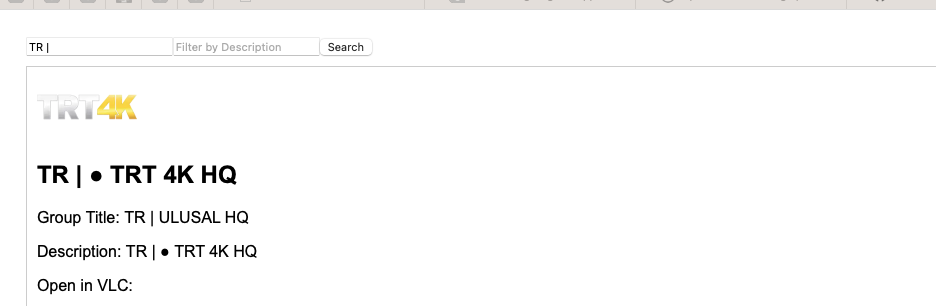

# JsonViewerApp

This project was generated with [Angular CLI](https://github.com/angular/angular-cli) version 16.2.0.

## Development server

Project not complete yet. Further instructions will follow.

## Summary

Two container images are built. One of the is downloading a .m3u file from HTTP server and serves it as a json data to the other service running on the json-viewer-app.

ENV variables needed to have a working frontend and backend

## Test drive

- Create a .env file under main directory and add two environment variables

```console
CURL_URL="http://iptv.link:8080/get.php?username=XXX&password=YYY&type=m3u_plus&output=mpegts"
SRV_PORT="4201"
```


- Create a file under json-viewer-app/.env


```console
NG_APP_ENV = "IPTV Dashboard"
NG_SVC_PORT="4301"
NG_SRV_PORT="80"
```


- Before running `docker compose up -d` execute the following command or set the environment variable

```console
export SRV_PORT=4201
docker compose up -d
```

- Allow sometime (20-50 sn) so that download-app to get the data and open your browser and connect to http://localhost:4200. You should see a screen like the one below


